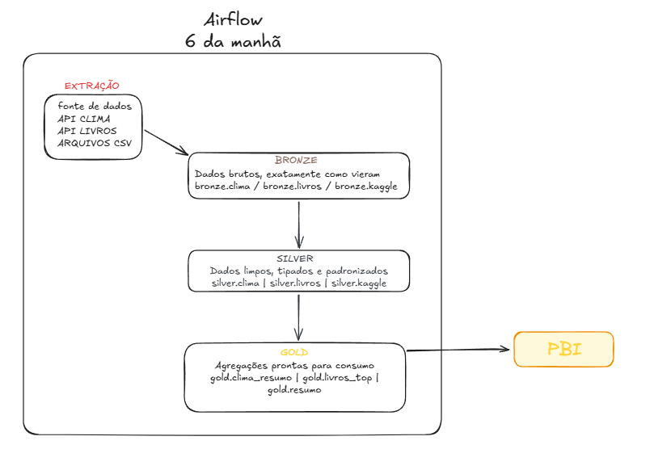

# Data Engineering Pipeline

Pipeline de engenharia de dados completo, construído do zero com arquitetura **Medallion (Bronze → Silver → Gold)**, orquestrado com **Apache Airflow** e containerizado com **Docker**.

---

## Sobre o Projeto

Este projeto simula um pipeline de dados simples seguindo algumas boas práticas profissionais, cobrindo todo o ciclo de vida dos dados: ingestão de múltiplas fontes, transformação em camadas e disponibilização de dados prontos para análise.

Desenvolvido como projeto de portfólio e consolidação de conceitos para demonstrar habilidades práticas em Engenharia de Dados.

---

##  Arquitetura



---

## Tecnologias

| Categoria | Tecnologia |
|---|---|
| Linguagem | Python 3.8 |
| Orquestração | Apache Airflow 2.8 |
| Banco de Dados | PostgreSQL 15 |
| Containerização | Docker + Docker Compose |
| Manipulação de Dados | Pandas, SQLAlchemy |
| Fontes de Dados | REST APIs (JSON), CSV |

---

## Estrutura do Projeto

```
data-engineering-pipeline/
│
├── dags/
│   └── pipeline_completo.py       # DAG principal do Airflow
│
├── src/
│   ├── database/
│   │   └── connection.py          # Conexão com PostgreSQL
│   │
│   ├── ingestion/                 # Camada Bronze
│   │   ├── weather_ingestion.py   # Ingestão da API de Clima
│   │   ├── ingest_books.py        # Ingestão da API de Livros
│   │   └── csv_ingestion.py       # Ingestão do CSV (Kaggle)
│   │
│   └── transformation/            # Camadas Silver e Gold
│       ├── silver_clima.py
│       ├── silver_livros.py
│       ├── silver_kaggle.py
│       ├── gold_clima.py
│       ├── gold_livros.py
│       └── gold_kaggle.py
│
├── data/
│   └── raw/                       # Arquivos CSV locais
│
├── logs/                          # Logs do Airflow
├── docker-compose.yml             # Infraestrutura completa
├── requirements.txt
└── .env                           # Variáveis de ambiente
```

---

## Como Executar

### Pré-requisitos
- [Docker Desktop](https://www.docker.com/products/docker-desktop) instalado e rodando
- Git

### 1. Clone o repositório
```bash
git clone https://github.com/diasgomess/data-engineering-pipeline.git
cd data-engineering-pipeline
```

### 2. Configure as variáveis de ambiente
Copie o arquivo de exemplo e ajuste os valores sensíveis:
```bash
cp .env.example .env
```

No Windows PowerShell:
```powershell
Copy-Item .env.example .env
```

Exemplo de `.env`:
```env
DB_HOST=localhost
DB_PORT=5432
DB_NAME=engenharia_dados
DB_USER=postgres
DB_PASSWORD=sua_senha_forte

AIRFLOW_POSTGRES_USER=airflow
AIRFLOW_POSTGRES_PASSWORD=sua_senha_forte_airflow
AIRFLOW_POSTGRES_DB=airflow

AIRFLOW_ADMIN_USER=admin
AIRFLOW_ADMIN_PASSWORD=sua_senha_forte_admin
```

### 3. Suba a infraestrutura
```bash
# Primeira vez — inicializa o banco do Airflow
docker compose up airflow-init

# Sobe todos os serviços
docker compose up -d
```

### 4. Acesse o Airflow
Abra [http://localhost:8080](http://localhost:8080) no navegador.
- **Usuário:** admin
- **Senha:** admin

### 5. Execute o pipeline
Ative a DAG `pipeline_completo` e clique em **Trigger DAG**.

---

## 🔄 DAG — pipeline_completo

O pipeline é executado diariamente às 06:00 e segue o fluxo:

```
bronze_livros  ──▶  silver_livros  ──▶  gold_livros
bronze_clima   ──▶  silver_clima   ──▶  gold_clima
bronze_kaggle  ──▶  silver_kaggle  ──▶  gold_kaggle
```

Cada linha roda em **paralelo**, respeitando a dependência entre camadas.

---

## Fontes de Dados

| Fonte | Tipo | Descrição |
|---|---|---|
| [Open-Meteo](https://open-meteo.com/) | API REST (sem token) | Dados meteorológicos de São Paulo |
| [Open Library](https://openlibrary.org/developers/api) | API REST (sem token) | Catálogo de livros com avaliações |
| Kaggle - Boston Housing | CSV | Dataset clássico de preços de imóveis |

---

## Decisões Técnicas

**Por que arquitetura Medallion?**
Separar os dados em Bronze/Silver/Gold garante rastreabilidade — sempre é possível reprocessar uma camada sem perder os dados originais.

**Por que Airflow?**
É o orquestrador mais utilizado no mercado para pipelines de dados, com suporte a agendamento, retry automático e monitoramento visual.

**Por que Docker?**
Garante que o projeto rode de forma idêntica em qualquer ambiente, eliminando problemas de dependências locais.

---

##  Próximas Melhorias

| # | Melhoria | Descrição |
|---|---|---|
| 1 | **Qualidade de Dados** | Implementar validações com Great Expectations ou Pandera entre as camadas |
| 2 | **Dashboard** | Conectar a camada Gold ao Power BI para visualização dos dados |
| 3 | **Testes Automatizados** | Adicionar testes unitários com Pytest para as funções de transformação |
| 4 | **Alertas de Falha** | Configurar notificações por e-mail ou Slack quando uma task do Airflow falhar |
| 5 | **Mais Fontes** | Ingerir dados de APIs financeiras (ex: Yahoo Finance) e redes sociais |
| 6 | **dbt** | Substituir as transformações Silver/Gold por modelos dbt para maior rastreabilidade |
| 7 | **CI/CD** | Criar pipeline no GitHub Actions para validar a DAG automaticamente a cada push |
| 8 | **Cloud** | Migrar para AWS (S3 + RDS + MWAA) ou GCP (BigQuery + Cloud Composer) |

---

> **Nota sobre Extração Incremental:** O pipeline atual realiza carga completa (full load) a cada execução. 
> A extração incremental não foi implementada pois as APIs utilizadas (Open-Meteo e Open Library) 
> não oferecem suporte nativo a filtros por data de atualização ou paginação incremental em seus 
> endpoints gratuitos. Em um ambiente produtivo com fontes que suportem incrementalidade 
> (ex: bancos de dados com campo `updated_at`, APIs com cursor de paginação), 
> essa seria a abordagem recomendada para reduzir volume de dados processados e custo operacional.

---

## Autor

Feito por **Matheus Gomes** — trainee de Engenharia de Dados.

[](https://www.linkedin.com/in/matheus-gomes-21279832a/)
[](https://github.com/diasgomess)
